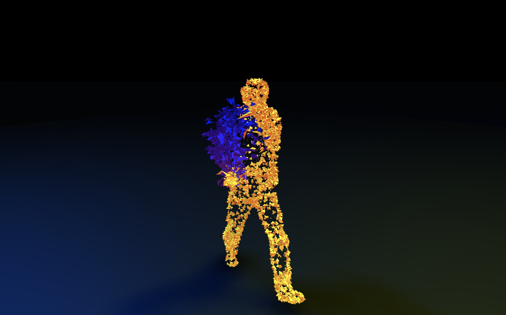

# three_skinned_instanced_geom
Three.js experiment for skinnedmesh with particles

## Description
This project show how to setup a particle system using [three.js](https://threejs.org/).

it use a THREE.InstancedMesh with a THREE.SkinnedMesh to spawn the particles. 

Material use a THREE.MeshStandardMaterial shader with the onBeforeCompile methods to inject custom code in certex an fragment shader.

## Todo Items

- Write particles positions in a THREE.DataTexture to make particles easier to animate.

